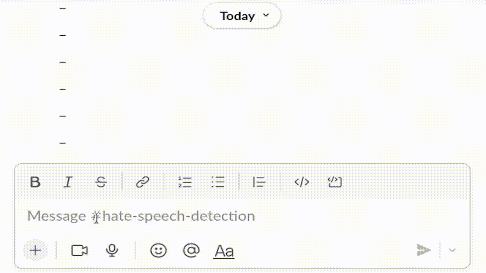
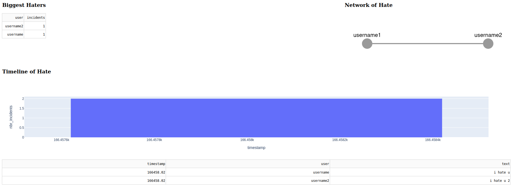
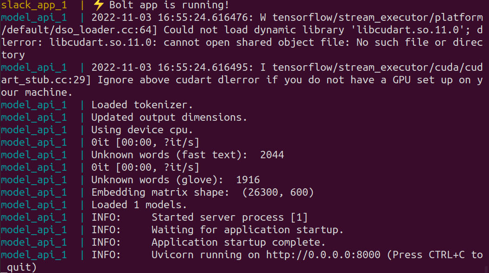

# hate-speech-detector
A Slack app that detects hate speech using AI, and a dashboard to show top offenders and visualize their social networks.



The Slack app hits the model API to classify messages as hate speech.  If the prediction meets some threshold, the bot 
posts a message asking the user to re-consider their message.  The event is written to a SQLite database, which can be 
used for analysis.

A rudimentary dashboard (Dash/Plotly) is provided to list top offenders and visualize their social networks.  



# How to Use It

I <em>strongly</em> recommend either hosting Docker on a GPU, or training the model offline with a CUDA capable machine 
and letting Docker copy the trained .pt and .pkl files to the image during the build process.  Otherwise, the model 
will be trained <em>during</em> the image build, and it will take a very long time.  To run training offline:

```commandline
cd services/hate_speech_model/src
python train.py
```

Training will download the required word vectors, fit a tokenizer, and train a classifier.  These artifacts will be 
stored in services/hate_speech_model/src/models and services/hate_speech_model/src/word_vectors.  Assuming you have 
already trained the model, create a .env file to hold your app and bot tokens, and start up the model API and 
Slack Bolt with docker compose.

Example of .env with your tokens.
```commandline
$ cat .env
SLACK_BOT_TOKEN=xoxb-
SLACK_APP_TOKEN=xapp-
```

Startup:

```commandline
docker-compose up --build
```

Of course, it would be better to save the model artifacts to cloud storage and avoid making them part of the image 
entirely.  It would also be better to use Docker secrets instead of environment variables for the tokens.

You will know startup has finished when you see this:



## What Counts as Hate Speech

The hate speech classifier will return a probability between 0 and 1 for every message posted in Slack.  The default 
threshold is 0.5.  You can make this higher to detect less hate speech, or lower to detect more hate speech.  Set the 
threshold in docker-compose.yml.

## Integration with Slack

To use this app for hate speech detection in Slack, you will need a [Slack account](https://slack.com) and workspace.  
Follow the basic, [getting-started tutorial](https://slack.dev/bolt-python/tutorial/getting-started) for Slack Bolt to:
1. Create a new Slack app
2. Add features & functionality -> bots
3. Add scopes for: channels:join, channels:read, chat:write, chat:write:public, chat:write:customize, groups:read, 
im:read, mprim:read, metadata.message.read, users.profile.read, users:read
4. Install OAuth and copy the bot user OAuth token
5. Add an app level token for connections:write with whatever name you want, then copy this token too
6. Enable socket mode
7. Subscribe to bot events with message.channels, message.groups, message.im, message.mpim
8. Install the app to a workspace
9. Add the bot to the channels you need (@ mention your bot's name can do this)

Once the app has been set up in your Slack account and the Slack Bolt app is running in Docker, you are ready to 
go.  Start sending messages and watch your bot jump into action when hate speech is detected.

## Using the Dashboard

Hate speech events will be logged by the Slack bolt app in a SQLite DB.  This DB can be used for monitoring and 
analytics.  If you do not have a business intelligence tool, you can use the Dash/Plotly dashboard that comes 
included.  It is a very minimal dashboard, but it can be accessed at: http://0.0.0.0:8050.

The dashboard is hosted in the same container as the Slack Bolt app.  Bolt runs in the background.  The dashboard will 
auto-refresh every 3 seconds.

# The Model

The hate speech model is a classifier that was trained on 
[Kaggle's Jigsaw Unintended Bias dataset](https://www.kaggle.com/competitions/jigsaw-unintended-bias-in-toxicity-classification/rules).
The model uses a combination of [GloVe](https://nlp.stanford.edu/projects/glove/) and [FastText](https://fasttext.cc/) 
word vectors.  The model stacks a transformer on top of the word embeddings, where the encoder is a bi-directional 
LSTM, and the decoder is a standard attention module.  

The model was inspired by reviewing several of the top scoring models for the Jigsaw competition, taking a few ideas 
from each.  See [this one](https://www.kaggle.com/code/bminixhofer/deterministic-neural-networks-using-pytorch/notebook) 
and [this one](https://www.kaggle.com/code/bminixhofer/simple-lstm-pytorch-version/notebook), both by Benejamin 
Minixhofer, and [this one](https://www.kaggle.com/code/shujian/single-rnn-with-4-folds-clr/notebook) by Shujian Liu. 

Refer to the Jupyter notebooks in services/hate_speech_model/src/notebooks to see draft versions of the models and 
trace how it came together.
